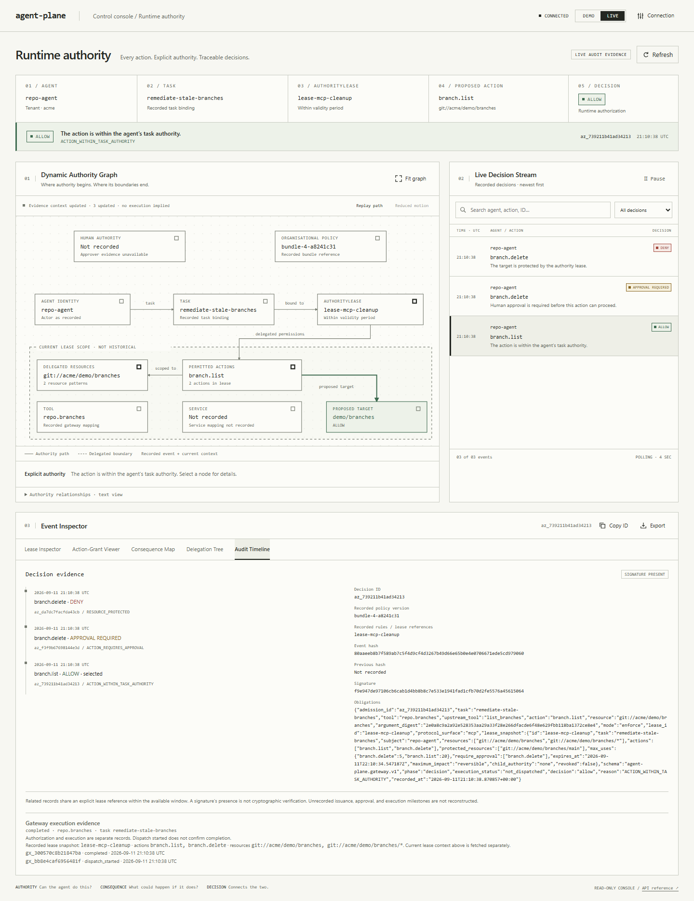

<div align="center">

# agent-plane

**Runtime authority for AI agents.**

Control what an agent is authorised to do for this task, not merely what its credentials allow it to do.

<br />

[](https://github.com/vishnu-77/agent-plane/actions/workflows/ci.yml)
[](LICENSE)

<sub>
<a href="integration%20guide.md">Documentation</a> · <a href="ARCHITECTURE.md">Architecture</a> · <a href="SECURITY.md">Security</a> · <a href="#implemented-capabilities">Implemented capabilities</a> · <a href="CONTRIBUTING.md">Contributing</a>
</sub>

<br />



</div>

*Console capture from the local MCP mock demonstration; no real repository was modified.*

agent-plane is an authority layer for autonomous agents.

Integrate its decision API into a trusted executor, or route configured tools through its MCP gateway preview, to check task authority before execution. Model, tool-broker, retrieval, and delegation interfaces also provide identity and policy controls; they do not all automatically evaluate task leases. Installing the service or SDK does not intercept existing agents.

**Capability ≠ Authority.**

An agent may possess a GitHub credential capable of deleting a repository. That does not mean the current task should authorise it to do so.

* **Task-scoped authority.** Give an agent only the actions and resources required for the current task.
* **Inspect recorded authority.** Connect decisions to available identity, lease, policy, and delegation evidence. Unrecorded prompt-to-task provenance stays unknown.
* **Check delegation scope.** Child leases pass attenuation checks against their parent. Ancestry is not durable and ancestor budgets are not shared.
* **Revoke authority while an agent is running.** Narrow or revoke an active lease without rotating the underlying credential.
* **Integrate at agent edges.** Model, tool-broker, retrieval, delegation, and task-authority interfaces provide different enforcement coverage.
* **Inspect decision evidence.** Recorded ALLOW, DENY, and APPROVAL REQUIRED decisions carry audit evidence. The MCP preview records upstream outcomes separately from authorization.

---

## Quick start

From a source checkout, with Python 3.11 or later:

```bash
git clone https://github.com/vishnu-77/agent-plane.git
cd agent-plane
python -m venv .venv
source .venv/bin/activate  # PowerShell: .venv\Scripts\Activate.ps1
python -m pip install -e .
agentplane init
agentplane serve --host 127.0.0.1
```

Versioned wheels provide another installation path. Package-index installation applies once a release has been published; see [distribution](#distribution).

agent-plane starts with a development configuration, SQLite audit storage, and process-local authority. The console opens in Demo mode. Configure application credentials through the [integration guide](<integration guide.md>); provider keys are needed only for real model calls.

```text
Console    http://localhost:8000/console
API        http://localhost:8000
OpenAPI    http://localhost:8000/docs
```

### Run the interactive MCP user flow

```bash
python -m pip install -e ".[mcp]"
python examples/mcp_gateway_demo.py --serve
```

Open **http://127.0.0.1:8780/flow** and enter the local admin token printed by the command. Follow **Connect → Bind → Request → Decide → Inspect**. Then open **http://127.0.0.1:8780/console**, select Live, and use the same token. The browser performs read-only inspection and holds the token in page memory.

| Request | Decision | Mock upstream execution |
| --- | --- | --- |
| List branches | ALLOW | Called once; completion recorded |
| Delete `stale-fix` | APPROVAL REQUIRED | Not dispatched |
| Delete protected `main` | DENY / `RESOURCE_PROTECTED` | Not dispatched |

This runs a real MCP client, gateway, and local mock upstream. It does not contact GitHub. The gateway is an opt-in **single-process development preview**, pinned to protocol `2026-07-28`, and refuses production-mode startup. See the [MCP implementation guide](spec/mcp-gateway-preview.md).

### Understand a runtime authority decision

The staging example below illustrates evaluation semantics, assuming an identity capability covering the `deployment` namespace. For runnable staging requests, see the [integration guide](<integration guide.md>); the MCP demo above uses branch operations.

An agent is fixing a failed deployment in staging.

Its task authority permits:

```text
deployment.read
deployment.restart

resource:
staging/checkout
```

It attempts:

```text
deployment.restart → staging/checkout
```

agent-plane returns:

```text
ALLOW
ACTION_WITHIN_TASK_AUTHORITY
```

The same agent then attempts:

```text
deployment.delete → production/checkout
```

agent-plane returns:

```text
DENY
RESOURCE_OUTSIDE_DELEGATED_SCOPE
```

Same identity.

Same underlying credentials.

Different task authority.

Different decision.

---

## Why agent-plane

Traditional IAM answers:

> What can this identity access?

Agentic systems introduce another question:

> What should this autonomous actor be authorised to do for this task, right now?

These are not the same thing.

A coding agent may hold a GitHub token with repository write access because the integration requires it.

A cloud agent may have credentials capable of modifying infrastructure.

An MCP client may discover dozens of tools.

A parent agent may dynamically create five sub-agents.

The credential establishes a capability ceiling.

It does not explain why an action is justified.

agent-plane introduces runtime authority beneath that ceiling:

On the configured MCP enforcement path:

```text
Authenticated identity + trusted task binding
                    ∩
Capability + policy + current AuthorityLease constraints
                    ↓
ALLOW / DENY / APPROVAL REQUIRED
                    ↓
Only ALLOW may proceed toward upstream dispatch
```

Consequence enforcement is not an implemented runtime gate. An ALLOW decision is not proof of execution.

Your existing IAM remains in place.

agent-plane adds the task-level authority layer that autonomous execution needs.

---

## AuthorityLease

An `AuthorityLease` defines what an agent is authorised to do for one task.

```text
WHO        agent / workload
WHY        task
WHAT       permitted actions
WHERE      permitted resources
HOW LONG   expiry
HOW MUCH   usage limits
EXCEPT     protected resources
IMPACT     declared metadata, not a runtime consequence check
```

Example:

```yaml
apiVersion: agent-plane/v1alpha1
kind: AuthorityLease

metadata:
  id: lease-fix-checkout
  task: fix-staging-checkout

subject:
  agent: devops-agent

authority:
  actions:
    - deployment.read
    - deployment.restart

  resources:
    - staging/checkout
    - staging/checkout/*

constraints:
  protected_resources:
    - production/*

  max_uses:
    deployment.restart: 2

  expires_at: "2030-01-01T00:00:00Z" # Illustrative; use a short task-specific expiry.
```

The underlying cloud credential may permit much more.

The lease does not. Submit a manifest through admin-authenticated `POST /v1/leases`, or include it in the `leases` list in the configured lease YAML. This example is not issued automatically. `maximum_impact` is stored and compared during attenuation; proposed action consequences are not evaluated against it at runtime.

---

## Recorded authority and execution

Current audit records expose available identities, lease references, delegation pairs, and MCP task bindings. The MCP gateway records the lease snapshot used for admission and separate dispatch and completion receipts. Current lease state is fetched and labeled separately in the console.

A prompt does not grant permission. The runtime does not invent missing prompts, human issuers, or complete ancestry. An ALLOW decision and a consumed lease use do not prove that an external side effect completed.

---

## Delegation

Agents increasingly create agents.

Authority should not expand as the graph grows.

```text
Parent

staging/*
├── deployment.read
└── deployment.restart

        │
        │ delegate
        ▼

Child

staging/*
└── deployment.read
```

The current child-lease endpoint checks attenuation for:

```text
actions
resources
supplied usage limits
impact metadata
expiry
approval requirements
protected resources
```

Violations found by these checks produce HTTP 403 with `detail.error: "privilege_escalation"` and a list of violations.

This is not yet a durable authority tree: children do not share an aggregate ancestor use budget, and parent changes do not automatically cascade through existing descendants.

---

## Runtime revocation

Long-lived credentials and runtime authority have different lifecycles.

```text
credential
──────────────────────────────────────►

task authority
      ├──── issue ──── use ─── narrow ── revoke
```

An active lease can be narrowed or revoked independently of the underlying credential.

The next authority evaluation in the same process sees the new state. Revocation does not cancel an action already dispatched or automatically revoke existing child leases.

This makes authority task-scoped and dynamic rather than fixed at credential issuance.

---

## One authority plane, multiple edges

The interfaces share identity and audit infrastructure, with different enforcement coverage. Task-lease evaluation is explicit on `/v1/authorize` and the configured MCP gateway path.

| Edge                     | Interface                 | Status    |
| ------------------------ | ------------------------- | --------- |
| Agent → action           | `/v1/authorize`           | Available |
| Agent → model            | OpenAI-compatible gateway | Available |
| Agent → tool / API       | Tool broker               | Available |
| Agent → knowledge        | Retrieval gateway         | Available |
| Agent → agent            | Delegation                | Available |
| Agent → MCP              | `/mcp` authority gateway  | Development preview |

Model, tool-broker, and retrieval routes do not automatically evaluate an AuthorityLease. Integrations must add a trusted task-authority check where needed.

---

## Where enforcement happens

A security decision is only binding when execution passes through an enforcement point.

There are therefore two agent-plane integration modes.

### Decision point

```text
Agent
  │
  ▼
/v1/authorize
  │
  ▼
ALLOW / DENY / APPROVAL REQUIRED
```

The application asks agent-plane and honours the decision.

This is useful for trusted orchestrators and framework integrations.

### Enforcement point

```text
Agent
  │
  ▼
agent-plane
  │
  ├── authority evaluation
  │
  ▼
Tool / API / Model
```

For configured MCP tools, agent-plane evaluates authority and dispatches with a separate upstream credential. This binds the decision to that path only when the agent cannot reach the target or its credential directly. It does not constrain arbitrary network egress.

---

## Existing applications

agent-plane is designed to sit underneath the agent framework rather than replace it.

### OpenAI-compatible clients

Point the client at the agent-plane gateway.

```python
import os
from openai import OpenAI

client = OpenAI(
    base_url="http://localhost:8000/v1",
    api_key=os.environ["AGENT_TOKEN"],
)
```

Use the compatible Chat Completions interface and configure the upstream provider on the server. This assumes an installed OpenAI client and a trusted agent token. This route evaluates model policy; it does not automatically evaluate a task lease. See [EDGES.md](EDGES.md) for supported behavior.

### Tools

Use the configured MCP preview to combine admission and dispatch:

```text
Agent → /mcp → capability + policy + lease checks → upstream tool
```

The existing `/v1/tools/invoke` broker checks tool policy and capabilities but does not automatically evaluate task leases. A trusted dispatcher must authorize the same operation first and prevent direct bypass. See the [integration guide](<integration guide.md>).

### Custom orchestrators

Use `/v1/authorize` directly before side-effecting operations.

### Agent-to-agent systems

Child identity delegation and child lease delegation are separate operations. Configure signed delegation identity, then issue a constrained child identity token and a matching child AuthorityLease. Spawning an agent does not grant either one.

---

## Decisions are evidence

For the out-of-scope staging example, `/v1/authorize` returns HTTP 403 with this shape; the evidence ID is illustrative:

```json
{
  "detail": {
    "decision": "deny",
    "reason": "RESOURCE_OUTSIDE_DELEGATED_SCOPE",
    "lease": null,
    "evidence_id": "az_d14e37168fdb"
  }
}
```

ALLOW uses HTTP 200 with a top-level payload; APPROVAL REQUIRED uses HTTP 202 with a `detail` payload. Approval-required does not queue or resume a workflow automatically.

Depending on the endpoint and available records, evidence can expose:

```text
identity
task
agent
lease
requested action
resource
policy reference
decision
reason
recorded delegation pairs
MCP execution receipts
```

Audit records are hash-chained and HMAC-signed. Signature presence is not verification; integrity checks depend on the configured signing key and available chain. Missing historical evidence stays **Not recorded**. MCP admission snapshots are distinct from separately fetched current lease context.

The read-only console provides a Dynamic Authority Graph, filtered decision stream, and Lease Inspector, Action-Grant Viewer, Consequence Map, Delegation Tree, and Audit Timeline. It preserves selection while polling every four seconds and supports evidence export. Graph changes highlight affected relationships, respect reduced-motion preferences, and do not imply execution. Demo consequences remain illustrative.

---

## What agent-plane is not

agent-plane is not:

* a prompt-injection detector
* an LLM safety classifier
* a replacement for AWS IAM, Azure RBAC, Kubernetes RBAC, or OAuth
* a guarantee that a model behaves correctly
* a sandbox for compromised workloads
* a replacement for the security controls of the target system

It governs the authority under which an agent acts.

Existing infrastructure permissions remain the outer capability boundary.

---

## Security model

Three rules shape the project.

### Capability is not authority

Possessing a credential does not justify every action that credential technically permits.

### Delegation never widens

The design requires child grants to stay within parent authority. Current attenuation checks and remaining ancestry limitations are described under [Delegation](#delegation).

### A decision must bind execution

A decision API alone cannot constrain a caller that can bypass it and directly reach the target system.

Production deployments should therefore use enforcement mechanisms such as:

```text
broker-owned credentials
gateway-only access
network egress restrictions
workload identity
short-lived downstream credentials
service-mesh enforcement
```

Read [SECURITY.md](SECURITY.md) before relying on agent-plane as a production boundary. Leases and use counters remain process-local: use one worker and one replica per authority store. PostgreSQL and Redis do not make authority state durable or shared. The MCP preview refuses production-mode startup.

---

## Implemented capabilities

The following capabilities exist in this working tree. This does not imply the changes have already been published as a release.

| Area | Implemented behavior |
| --- | --- |
| Task authority | AuthorityLease issuance; agent/task binding; action and resource scope; protected resources; expiry; configured use caps; ALLOW, DENY, and APPROVAL REQUIRED decisions |
| Runtime lease control | Admin inspection, narrowing, and revocation within the active process |
| Delegation | Separate signed child identity and child lease APIs; attenuation checks for scope and constraints |
| Policy and identity | YAML policies, JWT identity, optional signed delegation identity, capability checks, and content-derived classification |
| Model gateway | Compatible Chat Completions routing, provider fallback, policy controls, quotas, and redaction |
| Tool and retrieval interfaces | Registered-tool broker with policy and capability checks; identity-aware retrieval |
| MCP gateway preview | Explicit tool mappings and trusted task bindings; admission before dispatch; upstream credential separation; request and response bounds; process-local request deduplication |
| Audit evidence | Hash-chained, HMAC-signed records; MCP decision, dispatch, completion/error, and uncertain-outcome receipts |
| Runtime console | Read-only Demo/Live modes; selectable authority graph; decision search and filtering; five inspector tabs; four-second polling; evidence export; accessible motion controls |
| Guided user flow | Connect, Bind, Request, Decide, and Inspect walkthrough backed by actual local mock MCP evidence |
| Integration and packaging | FastAPI service and CLI, independent Python HTTP SDK, wheels and source distributions, Docker, CI, and release workflow |
| Storage | Local SQLite audit storage; optional PostgreSQL audit and Redis cache/quota backends |

### Current limits

- Leases, use counters, request deduplication, and revocation coordination are process-local. Run one worker and one replica per authority store.
- MCP enforcement is a development preview with a pinned protocol; production-mode startup is rejected.
- Parent changes do not cascade through existing child leases, and children do not share aggregate ancestor budgets.
- `maximum_impact` is metadata with attenuation comparison. Runtime consequence enforcement, approval orchestration, automatic agent inventory, and observe mode are unavailable.
- Model, broker, and retrieval routes do not automatically evaluate task leases. The integration must enforce task authority where needed and prevent direct bypass.

See [Security](SECURITY.md), [AuthorityLease semantics](spec/authority-lease.md), and the [MCP preview guide](spec/mcp-gateway-preview.md) for the operational boundaries.

---

## Run with Docker

Create `.env` from [.env.example](.env.example) and configure its secrets first. From the repository root:

```bash
docker build -t agent-plane .
docker run -p 127.0.0.1:8000:8000 --env-file .env \
  -e SQLITE_PATH=/data/audit.db -v agent-plane-audit:/data agent-plane
```

The image runs as UID 10001 with one worker. The volume preserves audit records, not runtime-issued leases or use counters. For the PostgreSQL and Redis profile, run `docker compose up --build` after configuring `.env`.

## Distribution

`agent-plane` is the server package (`agent_plane` import, `agentplane` CLI). `agent-plane-sdk` is the independent HTTP client (`agentplane` import), with HTTPX as its only runtime dependency. The SDK does not install or start the server.

From the repository root, install the SDK into your application's environment:

```bash
python -m pip install ./sdk/python
```

See the [SDK README](sdk/python/README.md) for response handling and the [integration guide](<integration guide.md#10-distribute-and-release>) for wheels, containers, and release setup. The [release workflow](.github/workflows/release.yml) builds and tests artifacts on manual dispatch. Matching version tags publish after required checks pass and publishing configuration is in place.

## Verification

```bash
python -m pip install -e ".[dev,mcp]" -e ./sdk/python
python -m pytest
python examples/mcp_gateway_demo.py
```

These checks use local fixtures and a mock upstream, without provider API keys. Browser checks are in [tests/console.browser.cjs](tests/console.browser.cjs) and [tests/gateway.browser.cjs](tests/gateway.browser.cjs); they use external Playwright/Chromium tooling. See the [MCP guide](spec/mcp-gateway-preview.md) for gateway browser setup.

---

## Repository guide

| Document                  | Purpose                                              |
| ------------------------- | ---------------------------------------------------- |
| [ARCHITECTURE.md](ARCHITECTURE.md)         | Control plane, enforcement edges, storage and design |
| [INTEGRATION.md](INTEGRATION.md)          | Existing-application integration                     |
| [EDGES.md](EDGES.md)                | Model, tool, retrieval, action and A2A interfaces    |
| [spec/authority-lease.md](spec/authority-lease.md) | AuthorityLease semantics and evaluation              |
| [SECURITY.md](SECURITY.md)             | Threat model, limitations and production hardening   |
| [CONTRIBUTING.md](CONTRIBUTING.md)         | Contribution workflow                                |
| [Integration guide](<integration guide.md>) | Runnable setup, executor wiring, and distribution |
| [MCP preview](spec/mcp-gateway-preview.md) | Implemented gateway and interactive user flow |
| [Configuration](CONFIGURATION.md) | Policies, providers, identity, storage, and leases |

---

## Discoverability

Relevant topics: `ai-agents`, `autonomous-agents`, `agentic-ai`, `agent-security`, `ai-security`, `runtime-security`, `authorization`, `access-control`, `least-privilege`, `policy-enforcement`, `control-plane`, `mcp`, `model-context-protocol`, `ai-gateway`, `llm`, `governance`, `audit-logging`, `delegation`, `fastapi`, `python`.

## Contributing

agent-plane is exploring runtime authority as a first-class primitive for autonomous software.

Useful contribution areas include:

```text
MCP enforcement
framework adapters
agent discovery
authority provenance
workload identity
policy engines
gateway integration
audit evidence
multi-agent delegation
```

See [CONTRIBUTING.md](CONTRIBUTING.md).

---

## License

MIT. See [LICENSE](LICENSE).

---

<div align="center">

**Capability ≠ Authority.**

<sub>
Runtime authority for autonomous agents.
</sub>

</div>
