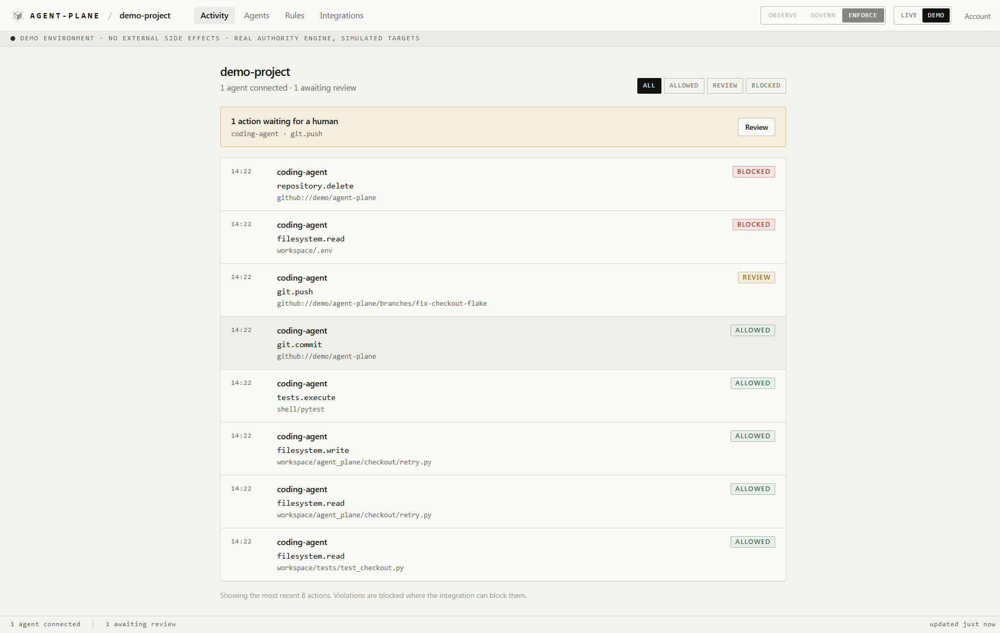

<div align="center">

<picture>
  <source media="(prefers-color-scheme: dark)" srcset="agent_plane/console/brand/logo-dark.svg">
  
</picture>

<br />

# See what your agents can do.<br />Control what they are allowed to cause.

<sub>
<a href="docs/README.md">Documentation</a> · <a href="docs/quickstart.md">Quickstart</a> · <a href="docs/demo.md">Hosted demo</a> · <a href="docs/concepts.md">Concepts</a> · <a href="SECURITY.md">Security</a>
</sub>

<br />

[](https://github.com/vishnu-77/agent-plane/actions/workflows/ci.yml)
[](LICENSE)

</div>

Connect your agents. See what they do, understand what authority sits behind
their actions, and control what they are allowed to cause.

Claude Code, Codex, Cursor, MCP servers, LangGraph, or your own application.

## Connect an agent

```bash
git clone https://github.com/vishnu-77/agent-plane.git && cd agent-plane
python -m venv .venv && source .venv/bin/activate      # PowerShell: .venv\Scripts\Activate.ps1
python -m pip install -e ".[dev]" -e ./sdk/python
agentplane serve --host 127.0.0.1
```

Open **http://127.0.0.1:8000/console**, create an account, and name a project.
The console shows you one command:

```bash
agentplane connect claude --key ap_live_...
```

That is the whole setup. There is no JWT to mint, no authority YAML to write,
no policy bundle to load, and no admin token to pass around. Activity appears
as soon as the agent does something.

```text
14:03  claude-code   filesystem.read    workspace/src/auth.ts       ALLOWED
14:03  claude-code   filesystem.write   workspace/src/auth.ts       WOULD REVIEW
14:03  claude-code   tests.execute      shell/npm                   ALLOWED
14:04  claude-code   repository.delete  github://acme/app           WOULD BLOCK
```

New projects start in **Observe**, so the first thing agent-plane does is
watch. Nothing is blocked until you say so.



<sub>The demo's coding-agent scenario, in Enforce. Real engine, simulated
targets: the push is held for a human, the protected file and the repository
deletion are refused.</sub>

## Then decide what they may do

A rule is three lists, written in the console or over the API:

```text
ALLOW       filesystem.read   tests.execute
ASK FIRST   filesystem.write  git.push
NEVER       repository.delete
```

`NEVER` is absolute. No other rule, lease, or delegation can grant it back.

agent-plane also drafts a rule from what your agents actually did: reads are
proposed as allowed, changes as ask-first, destructive actions as never. You
review it before it takes effect, and a suggestion disappears once a rule
covers it.

Rules can live in version control instead, next to the code they govern:

```bash
agentplane rules check permissions.yaml     # in the pull request
agentplane rules push  permissions.yaml --project prj_… --key ap_mgmt_…
```

## Three modes

| Mode | What happens |
| --- | --- |
| **Observe** | Every action is recorded and explained. Nothing is blocked. |
| **Govern** | Violations are decided and flagged. Execution is still the caller's. |
| **Enforce** | The decision binds, wherever the integration can enforce it. |

Enforcement is only ever claimed where it is real. A connector says what it
can observe and whether it can block, and every decision carries a `binding`
flag, so the product never implies it stopped something it could not stop.

| Integration | Sees | Can block |
| --- | --- | --- |
| Claude Code | every action | most actions |
| Codex | every action | most actions |
| MCP server | every action | yes |
| API / model gateway | every action | yes |
| Cursor / OpenCode | most actions | no |
| LangGraph, SDK, your app | what your code reports | your code decides |

## Capability ≠ Authority

Your agent has powerful credentials. A GitHub token that can delete a
repository. A cloud role that can restart production. An MCP server with
forty tools.

A credential describes what an agent technically **can** do.

agent-plane decides what the agent is **authorised** to do, right now, for
the task it is performing, and whether the **consequence** of an action fits
that task.

```text
AUTHORITY WITHOUT CONSEQUENCE IS INCOMPLETE.

deployment.restart  development/search    low impact, reversible
deployment.restart  staging/checkout      medium impact, no customers
deployment.restart  production/payments   critical, customer-facing, irreversible
```

Same verb three times. Three different consequences. Authorization has to
consider the second column, not just the first.

Every decision stays explainable through the whole chain, in the console and
in the signed audit record behind it.

```text
prompt   "Investigate why checkout is failing in staging. Do not touch production."
   ↓
task     incident-218
   ↓
agent    incident-agent            langgraph · workstation-02
   ↓
authority  logs.read  metrics.read  deployment.read  deployment.restart
           scope staging/checkout · protected production/*
   ↓
action   deployment.restart
   ↓
resource production/checkout                                   MISMATCH
   ↓
consequence  workload restarts; in-flight requests are dropped
             production · customer-facing · 3 downstream resources
   ↓
DENY     RESOURCE_OUTSIDE_DELEGATED_SCOPE
         CONSEQUENCE_OUTSIDE_TASK_BOUNDARY
```

## Three primitives

**Agent Registry** answers *who exists?* Agents, sessions, and tasks are
discovered from governed traffic, not entered by hand. Each record carries
identity, runtime, origin prompt, parent, declared capabilities, granted
authority, delegated authority, exercised authority, resources touched, and
decision history.

**Authority Lineage** answers *why can this agent do this?* Authority flows
from a human, event, or parent agent through leases that only ever narrow.
`ChildAuthority ⊆ ParentAuthority`. Prompts are provenance, not permission:
an LLM may ask for authority, it can never grant itself any.

```text
DENY   No authority lineage permits deployment.restart.

Human
└── incident-agent      logs.read  metrics.read  deployment.read
    └── metrics-agent   metrics.read
```

**Authority–Consequence Graph** answers *what can this authorised action
actually cause?* Two views of one runtime: who is authorised, from whom,
for which task; and what state changes, what is reachable downstream, how
reversible and how persistent it is. Consequence is modelled structurally,
never collapsed into a risk score.

```text
Executable Authority =
  Identity ∩ Task Authority ∩ Delegated Authority ∩ Resource Scope
           ∩ Policy ∩ Runtime Constraints ∩ Permitted Consequence
```

Outcomes: `ALLOW` · `DENY` · `APPROVAL` · `QUARANTINE` · `SIMULATE`.

## See it before you connect anything

The console has a **DEMO** switch. It runs the real authority engine against
simulated targets in an isolated project; nothing leaves your machine and
nothing external is touched.

Three scenarios ship: a coding agent that must stay inside its task, a GitHub
cleanup that must never delete `main`, and a delegation where a child agent
asks for authority no ancestor ever held.

## Change the route, not the agent

```text
BEFORE                         AFTER

Agent ─────► Model             Agent
      ─────► MCP                 │
      ─────► GitHub              ▼
      ─────► Cloud/API        agent-plane ── who is authorised × what they can cause
                                 ├────► Model        OpenAI-compatible gateway
                                 ├────► MCP          MCP gateway
                                 ├────► GitHub       broker / SDK middleware
                                 └────► Cloud/API    external authorization
```

One authority brain behind several enforcement surfaces. For lightweight
deployments its own gateways enforce. In enterprise environments an Envoy,
Kubernetes, or cloud gateway can ask agent-plane for the decision. Existing
IAM, model routers, and cloud gateways stay in place.

## Underneath

Once the story is clear, the mechanics are ordinary and documented:

| | |
| --- | --- |
| Ingestion | one endpoint every integration reports to: `POST /v1/events/action` · [api](docs/api-reference.md) |
| Projects and keys | `ap_live_` / `ap_test_` / `ap_mgmt_`, hashed at rest, shown once, rotate or revoke one machine |
| Rules | what you write; they compile into task-scoped authority, which is what the engine evaluates |
| `AuthorityLease` | that task-scoped grant: actions, resources, protected resources, use limits, approval, expiry, permitted consequence, lineage · [spec](spec/authority-lease.md) |
| Gateways | OpenAI-compatible, MCP, tool broker, retrieval · [integration](docs/integration/README.md) |
| Delegation | child leases and child identities that only attenuate · [authorization](docs/integration/authorization.md) |
| Revocation | narrow or revoke a live lease, quarantine an agent; every replica sees it |
| Approvals | a tracked request, a human decision, one resume · [approvals](docs/integration/approvals.md) |
| Audit | hash-chained, HMAC-signed decisions with the full trace · [api](docs/api-reference.md) |
| SDKs | Python and TypeScript clients, framework adapters, a fail-closed conformance kit · [python](sdk/python/README.md) · [typescript](sdk/typescript/README.md) |
| Deployment | Docker, Compose, Helm · [deploy](deploy/README.md) |
| Security model | what binds, what is advisory, and the limits · [SECURITY.md](SECURITY.md) |

## What agent-plane is not

Not an AI gateway, a model router, an MCP proxy, a prompt-injection
scanner, a content guardrail, an agent inventory product, an IAM
replacement, an API gateway, or a risk-scoring dashboard. It integrates with
many of those.

IAM answers *who can access this?* MCP authorization answers *which tool can
be called?* Inventory answers *which agents exist?* Guardrails answer *is this
model behaviour unsafe?*

agent-plane answers: **why does this agent have this authority, for this
task, and is it authorised to cause the consequence of this action?**

## License

MIT. See [LICENSE](LICENSE).
