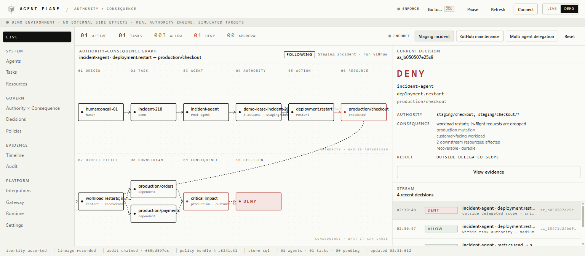

<div align="center">

<picture>
  <source media="(prefers-color-scheme: dark)" srcset="agent_plane/console/brand/logo-dark.svg">
  
</picture>

<br />

# See what your agents can do.<br />Control what they are allowed to cause.

<sub>
<a href="docs/README.md">Documentation</a> · <a href="docs/quickstart.md">Quickstart</a> · <a href="docs/demo.md">Hosted demo</a> · <a href="docs/concepts.md">Concepts</a> · <a href="SECURITY.md">Security</a>
</sub>

<br />

[](https://github.com/vishnu-77/agent-plane/actions/workflows/ci.yml)
[](LICENSE)

</div>

Connect Claude Code, Codex, LangGraph, MCP agents or your own agent.

agent-plane discovers the agents in your system, traces where their
authority came from, and evaluates the consequences of their actions before
those actions reach real systems.

```text
prompt   "Investigate why checkout is failing in staging. Do not touch production."
   ↓
task     incident-218
   ↓
agent    incident-agent            langgraph · workstation-02
   ↓
authority  logs.read  metrics.read  deployment.read  deployment.restart
           scope staging/checkout · protected production/*
   ↓
action   deployment.restart
   ↓
resource production/checkout                                   MISMATCH
   ↓
consequence  workload restarts; in-flight requests are dropped
             production · customer-facing · 3 downstream resources
   ↓
DENY     RESOURCE_OUTSIDE_DELEGATED_SCOPE
         CONSEQUENCE_OUTSIDE_TASK_BOUNDARY
```

Every decision stays explainable through that whole chain, in the console
and in the signed audit record behind it.



<sub>The LIVE screen after the staging-incident scenario: prompt → task → agent → authority → action → resource, folded into direct effect → downstream → consequence → DENY. Real engine, simulated targets.</sub>

## Capability ≠ Authority

Your agent has powerful credentials. A GitHub token that can delete a
repository. A cloud role that can restart production. An MCP server with
forty tools.

A credential describes what an agent technically **can** do.

agent-plane decides what the agent is **authorised** to do, right now, for
the task it is performing, and whether the **consequence** of an action fits
that task.

```text
AUTHORITY WITHOUT CONSEQUENCE IS INCOMPLETE.

deployment.restart  development/search    low impact, reversible
deployment.restart  staging/checkout      medium impact, no customers
deployment.restart  production/payments   critical, customer-facing, irreversible
```

Same verb three times. Three different consequences. Authorization has to
consider the second column, not just the first.

## Three primitives

**Agent Registry** answers *who exists?* Agents, sessions, and tasks are
discovered from governed traffic, not entered by hand. Each record carries
identity, runtime, origin prompt, parent, declared capabilities, granted
authority, delegated authority, exercised authority, resources touched, and
decision history.

**Authority Lineage** answers *why can this agent do this?* Authority flows
from a human, event, or parent agent through leases that only ever narrow.
`ChildAuthority ⊆ ParentAuthority`. Prompts are provenance, not permission:
an LLM may ask for authority, it can never grant itself any.

```text
DENY   No authority lineage permits deployment.restart.

Human
└── incident-agent      logs.read  metrics.read  deployment.read
    └── metrics-agent   metrics.read
```

**Authority–Consequence Graph** answers *what can this authorised action
actually cause?* Two views of one runtime: who is authorised, from whom,
for which task; and what state changes, what is reachable downstream, how
reversible and how persistent it is. Consequence is modelled structurally,
never collapsed into a risk score.

```text
Executable Authority =
  Identity ∩ Task Authority ∩ Delegated Authority ∩ Resource Scope
           ∩ Policy ∩ Runtime Constraints ∩ Permitted Consequence
```

Outcomes: `ALLOW` · `DENY` · `APPROVAL` · `QUARANTINE` · `SIMULATE`.

## Try it in two minutes

```bash
git clone https://github.com/vishnu-77/agent-plane.git && cd agent-plane
python -m venv .venv && source .venv/bin/activate      # PowerShell: .venv\Scripts\Activate.ps1
python -m pip install -e ".[dev]" -e ./sdk/python
agentplane serve --host 127.0.0.1
```

Open **http://127.0.0.1:8000/console**, keep the **DEMO** switch on, and run
*Staging incident*. Watch the graph build from the prompt to the denial,
then open the evidence. The demo runs the real authority engine against
simulated targets; nothing leaves your machine.

Three scenarios ship: a staging incident that must not touch production, a
GitHub cleanup that must never delete `main`, and a delegation where a child
agent asks for authority no ancestor ever held.

## Change the route, not the agent

```text
BEFORE                         AFTER

Agent ─────► Model             Agent
      ─────► MCP                 │
      ─────► GitHub              ▼
      ─────► Cloud/API        agent-plane ── who is authorised × what they can cause
                                 ├────► Model        OpenAI-compatible gateway
                                 ├────► MCP          MCP gateway
                                 ├────► GitHub       broker / SDK middleware
                                 └────► Cloud/API    external authorization
```

One authority brain behind several enforcement surfaces. For lightweight
deployments its own gateways enforce. In enterprise environments an Envoy,
Kubernetes, or cloud gateway can ask agent-plane for the decision. Existing
IAM, model routers, and cloud gateways stay in place.

Start in **Observe**: nothing is blocked, agents and their real behaviour are
discovered, a suggested authority profile is built from what each agent
actually did. Review it. Switch to **Enforce**.

```text
TASK      "Summarise customer support tickets"
EXPECTED  tickets.read
OBSERVED  tickets.read   customer.export  UNDECLARED   email.send  UNDECLARED
```

## Underneath

Once the story is clear, the mechanics are ordinary and documented:

| | |
| --- | --- |
| `AuthorityLease` | the task-scoped grant: actions, resources, protected resources, use limits, approval, expiry, permitted consequence, lineage · [spec](spec/authority-lease.md) |
| Gateways | OpenAI-compatible, MCP, tool broker, retrieval · [integration](docs/integration/README.md) |
| Delegation | child leases and child identities that only attenuate · [authorization](docs/integration/authorization.md) |
| Revocation | narrow or revoke a live lease, quarantine an agent; every replica sees it |
| Approvals | a tracked request, a human decision, one resume · [approvals](docs/integration/approvals.md) |
| Policies | organisation rules in YAML, hot-reloadable · [configuration](CONFIGURATION.md) |
| Audit | hash-chained, HMAC-signed decisions with the full trace · [api](docs/api-reference.md) |
| SDKs | Python and TypeScript clients, framework adapters, a fail-closed conformance kit · [python](sdk/python/README.md) · [typescript](sdk/typescript/README.md) |
| Deployment | Docker, Compose, Helm · [deploy](deploy/README.md) |
| Security model | what binds, what is advisory, and the limits · [SECURITY.md](SECURITY.md) |

## What agent-plane is not

Not an AI gateway, a model router, an MCP proxy, a prompt-injection
scanner, a content guardrail, an agent inventory product, an IAM
replacement, an API gateway, or a risk-scoring dashboard. It integrates with
many of those.

IAM answers *who can access this?* MCP authorization answers *which tool can
be called?* Inventory answers *which agents exist?* Guardrails answer *is this
model behaviour unsafe?*

agent-plane answers: **why does this agent have this authority, for this
task, and is it authorised to cause the consequence of this action?**

## License

MIT. See [LICENSE](LICENSE).
