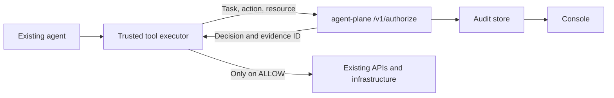

# Task authorization (advanced)

This is the layer underneath [rules](../rules.md). Read it when you need to
issue authority directly - one agent, one task, one lease - rather than
writing a project rule, or when you are wiring `POST /v1/authorize` into your
own executor by hand.

Nothing here is required to adopt agent-plane. The onboarding path is
[quickstart](../quickstart.md).

## 1. Where it fits



| Component | Responsibility |
| --- | --- |
| Your backend / orchestrator | Assign an authenticated agent identity and create task ids. |
| Your tool executor | Validate arguments, derive the canonical resource, call `/v1/authorize`, enforce the result. |
| agent-plane | Evaluate authority, consequence, and runtime constraints; return a decision and record evidence. |
| Your external service | Execute the exact operation the executor authorized. |
| Console | Read decisions, authority, and evidence. |

The executor must hold the actual tool credentials. An agent with an
independent credential or network route to the target can bypass an optional
check. Bind the task and identity to your authenticated workflow rather than
accepting a task chosen by the model.

## 2. Credentials

`/v1/authorize` accepts either:

- a **Project API Key** (`Authorization: Bearer ap_live_…` or `X-Api-Key`),
  which is what a developer normally holds. The project is the tenant; the
  agent comes from the request or `X-Agent-Id`. Nothing is minted by hand.
- an **agent identity token**, for deployments that issue their own.
  `IDENTITY_MODE=jwt_claims` verifies an HS256 JWT signed with `JWT_SECRET`;
  `IDENTITY_MODE=delegation` verifies an Ed25519-signed grant, which is what
  production should use. See [SECURITY.md](../../SECURITY.md) and
  [EDGES.md](../../EDGES.md).

Lease issuance (`POST /v1/leases`, `/v1/leases/from-template`, `PATCH`,
`DELETE`) is operator-gated: a console session, a management key
(`ap_mgmt_…`), or the deployment's `ADMIN_TOKEN`, all in `X-Admin-Token`.
Admin routes return 404 when `ADMIN_TOKEN` is unset and no other operator
credential is presented.

Keep the three roles separate: the runtime credential the executor uses, the
operator credential that issues authority, and the target credential that
performs the real operation.

## 3. Run a local runtime

```bash
python -m venv .venv && source .venv/bin/activate     # PowerShell: .venv\Scripts\Activate.ps1
python -m pip install -e ".[dev]" -e ./sdk/python
agentplane serve --host 127.0.0.1 --port 8000
```

Development needs no configuration. For anything beyond a laptop, set real
secrets:

```bash
python -c "import secrets; print('JWT_SECRET=' + secrets.token_urlsafe(32)); print('API_KEY_SECRET_VALUE=' + secrets.token_urlsafe(32)); print('AUDIT_SIGNING_KEY=' + secrets.token_urlsafe(32))"
```

Append that to a local, ignored `.env` without replacing unrelated
configuration. `ADMIN_TOKEN` is only needed if you want the break-glass
routes. Changing `.env` does not change a server that is already running.

The repository already contains `config/` and `policies/`; in a fresh
directory with the package installed, `agentplane init` scaffolds them.

## 4. Issue a lease

A lease binds **one agent** to **one task** with a narrow set of actions and
resources. `POST /v1/leases` takes a full document; `POST
/v1/leases/from-template` renders one of `config/lease-templates.yaml`.

```python
import os
from agentplane import AgentPlaneAdmin

admin = AgentPlaneAdmin("http://127.0.0.1:8000", os.environ["ADMIN_TOKEN"])
lease = admin.issue_from_template(
    "repair-service", subject="devops-agent", task="fix-checkout", tenant="prj_…",
    variables={"env": "staging", "service": "checkout"})
print(lease.id, lease.resources, lease.require_approval)
```

The lease's `tenant` must match the tenant the caller acts in - the project id
for a Project API Key, the `tenant` claim for an identity token. Template
variables may not contain globs or path traversal.

A lease document:

| Field | Meaning |
| --- | --- |
| `id`, `subject`, `task`, `tenant` | what it binds |
| `resources` | glob patterns it reaches |
| `actions` | what may be asked for |
| `denied_actions` | absolute refusals (this is what a rule's NEVER compiles to) |
| `protected_resources` | carve-outs inside `resources` that are always refused |
| `require_approval` | in scope, but a human decides |
| `max_uses` | `{action: n}` |
| `expires_at`, `maximum_impact`, `child_authority` | runtime ceilings |
| `permitted_consequence` | bounds on what the action may cause |

Runtime-issued leases persist in the authority store. On first start with an
existing database the YAML in `config/leases.yaml` is seeded once; afterwards
the stored copy wins, so redeploying the same YAML never un-revokes a lease.

## 5. Authorize an action

```python
from agentplane import AgentPlane

plane = AgentPlane(api_key=os.environ["AGENTPLANE_API_KEY"],
                   url="http://127.0.0.1:8000", agent="devops-agent")

print(plane.authorize(task="fix-checkout", action="deployment.read",
                      resource="staging/checkout").decision)
# allow                       ACTION_WITHIN_TASK_AUTHORITY
print(plane.authorize(task="fix-checkout", action="deployment.read",
                      resource="production/checkout").reason)
# RESOURCE_OUTSIDE_DELEGATED_SCOPE
pending = plane.authorize(task="fix-checkout", action="deployment.restart",
                          resource="staging/checkout")
print(pending.decision, pending.approval_id)
# approval_required apr_…
```

Raw HTTP, with the checks the SDK performs for you:

```python
def authorize(client, credential, *, task, action, resource):
    response = client.post(
        "/v1/authorize",
        headers={"Authorization": f"Bearer {credential}"},
        json={"task": task, "action": action, "resource": resource},
    )
    expected = {200: ("allow", "simulate"), 202: ("approval_required",),
                403: ("deny",), 423: ("quarantine",)}
    if response.status_code not in expected:
        response.raise_for_status()
        raise RuntimeError("Unexpected authorization status")
    body = response.json()
    decision = body.get("detail", body) if isinstance(body, dict) else None
    if (not isinstance(decision, dict)
            or decision.get("decision") not in expected[response.status_code]
            or not isinstance(decision.get("reason"), str)
            or not decision.get("evidence_id")):
        raise RuntimeError("Invalid authorization response; action blocked")
    return decision
```

### Response contract

| HTTP status | JSON location | Caller behaviour |
| --- | --- | --- |
| `200` | top level | execute only if `decision == "allow"`, or if `decision == "simulate"` and you accept observe mode |
| `202` | `detail` | pause for approval; do not execute |
| `403` | `detail` | block and surface the reason |
| `423` | `detail` | the agent is quarantined; stop |
| `401`, validation errors | error response | stop; fix authentication or the request |
| timeout or invalid JSON | no usable decision | stop; never assume allow |

`202` is wrapped in `detail` even though it is a 2xx response. Do not use
`response.ok` or `raise_for_status()` alone to authorize execution.

Authorization and execution are separate operations, not an atomic
transaction. The caller owns target validation, execution-result logging,
idempotency, and anything that changes in between. Avoid blindly retrying:
in enforce mode a successful check consumes a use count, and an
approval-required check consumes one too.

### Expected outcomes for the lease above

| Action / resource | Decision | Reason |
| --- | --- | --- |
| Read `staging/checkout` | ALLOW | `ACTION_WITHIN_TASK_AUTHORITY` |
| Restart `staging/checkout` | APPROVAL REQUIRED | `ACTION_REQUIRES_APPROVAL` |
| Restart `production/checkout` | DENY | `RESOURCE_OUTSIDE_DELEGATED_SCOPE` |
| Read a protected staging resource | DENY | `RESOURCE_PROTECTED` |

Production is outside `staging/*`, so its reason is outside delegated scope. A
protected staging resource matches the delegated scope but is carved out by
`protected_resources`, which is a separate reason.

In `observe` mode each of those DENY rows comes back as `simulate` with
`would_be: "deny"`; in `govern` mode as the real DENY with
`enforced: false`. See [modes.md](../modes.md).

## 6. Wrap your executor

```python
def guarded_restart(client, credential, task_id, deployment, existing_restart):
    decision = authorize(client, credential, task=task_id,
                         action="deployment.restart", resource=deployment)
    if decision["decision"] == "approval_required":
        return {"status": "approval_required", "approval_id": decision.get("approval_id"),
                "evidence_id": decision["evidence_id"]}
    if decision["decision"] != "allow":
        raise PermissionError(decision["reason"])
    return existing_restart(deployment)
```

The wrapper deliberately does not catch transport, authentication, or
malformed-response errors and then continue: any such failure must stop
execution. A pending decision must pause the task in your orchestrator; never
translate it into ALLOW yourself. Once an operator approves it, repeat the
identical authorize call with `"approval": "<id>"` to receive ALLOW /
`ACTION_APPROVED` exactly once. See [approvals](approvals.md).

The [framework adapters](frameworks.md) do this in one line for LangChain,
CrewAI, OpenAI Agents, and custom dispatch loops. Prove it fails closed with
the [conformance kit](conformance.md).

### Resource derivation matters

Leases match resources with glob patterns. `staging/*` matches
`staging/../production/x` textually, so the resource string must be built from
validated, canonical arguments in your executor - never from raw model output.
Lease templates apply the same rule to variables.

## 7. Narrow, revoke, delegate

```python
admin.shrink_lease(lease.id, actions=["deployment.read"])   # restart is gone immediately
admin.revoke_lease(lease.id)                                # everything is gone
```

`PATCH /v1/leases/{id}` only narrows. Widening is refused with 403
`privilege_escalation`. A revocation is effective on every replica at its next
evaluation, and the underlying credential is untouched.

### Delegation

`POST /v1/leases/{id}/delegate` is **not** admin-gated: the lease holder mints
its own attenuated child.

```python
child = plane.delegate(lease.id, agent="metrics-agent", actions=["metrics.read"])
```

- The caller's `agent_id` must equal the parent's `subject`.
- The parent must permit it (`child_authority != "none"`).
- The child is checked for attenuation: actions, resources, use limits,
  expiry, impact, and permitted consequence may only narrow. It may not
  re-grant anything in the parent's `denied_actions`, and it may not drop one
  of them.

When the child later asks for something the parent never had, the answer is
not "policy says no"; it is "no authority lineage permits it", with the chain.
`GET /v1/lineage/{lease_id}` returns that chain root-first.

`POST /v1/agents/delegate` is a different thing: a scoped child **identity
token**, available in delegation identity mode.

## 8. The console

Sign in at `/console` with the account that owns the project. The console
reads through the session cookie; no token is pasted into the UI.

| Screen | What it shows |
| --- | --- |
| Activity | reported actions and decisions, with a per-decision drawer: authority path, consequence, and the plain-English why |
| Agents | discovered agents, what they asked for, what they were granted, drift |
| Rules | the project's rules, templates, and suggestions |
| Integrations | connected integrations, their honest capability, and API keys |
| Settings | mode and data collection |

Connecting the console does not generate events. If the stream is empty, no
connector has reported yet.

## 9. Verify before connecting real side effects

| Scenario | Expected result |
| --- | --- |
| In-scope allowed action | the stub executes exactly once; retain its evidence id |
| Out-of-scope or protected resource | the stub never executes; inspect the recorded reason |
| Approval-required action | the stub never executes; the workflow is pending |
| Expired or revoked authority | new attempts are denied |
| Invalid credential | authentication fails and no action executes |
| Service unavailable or malformed response | no action executes |

```bash
python -m pytest tests/test_authority.py tests/test_admin.py tests/test_production.py -q
```

## 10. Deployment boundaries

- Leases, use counters, approvals, and the MCP request ledger live in the SQL
  authority store (`AUTHORITY_STORE=sql`, the default), sharing the audit
  database. Every replica must point at the same database; with PostgreSQL,
  admission holds an advisory lock and use reservation is a single atomic
  update, so `--workers N` and multiple replicas are safe. `memory` restores
  single-process behaviour and is refused in production.
- Lease lookup uses subject and task without a separate tenant key.
  Tenant-prefixing identifiers avoids accidental collisions but is not itself
  tenant isolation. Enforce ownership in your issuer.
- Signed delegation identity is supported; production startup rejects known
  default secrets but is not a full security review. See
  [SECURITY.md](../../SECURITY.md).
- Consequence assessment bounds a decision; rollback is not provided, and
  `maximum_impact` is a ceiling, not a guarantee about the world.
- Historical lease snapshots, complete approver lineage, and execution-result
  telemetry are not captured. The console leaves those fields unknown rather
  than synthesizing evidence.

## Troubleshooting

| Symptom | Check |
| --- | --- |
| `401 Invalid or revoked API key` | the key was rotated or revoked; reconnect with the new one |
| `403 this API key lacks the 'ingest' scope` | an `ap_mgmt_` key was used on a runtime route |
| `401 Invalid management key` | an `ap_live_` key was sent in `X-Admin-Token` |
| Admin endpoint `404` | `ADMIN_TOKEN` is unset and no other operator credential was presented |
| `NO_ACTIVE_LEASE` | no rule applies and no lease binds this agent to this task |
| `ACTION_REFUSED_BY_RULE` | a rule lists the action under NEVER; nothing overrides that |
| `ACTION_OUTSIDE_CAPABILITY_MANIFEST` | the identity token's capability namespace does not cover the action |
| Pending approval treated as success | unwrap `detail` and inspect the decision, including on HTTP 202 |
| `APPROVAL_MISMATCH` on resume | the resume must repeat the exact task, action, and resource |
| Lease state differs from YAML after restart | stored leases win over the YAML seed; delete the row or issue a new id |
| Empty activity stream | connecting the console does not generate events |

Further reference: [configuration](../../CONFIGURATION.md),
[endpoint examples](../../EDGES.md), and the
[authority specification](../../spec/authority-lease.md). Where older narrative
notes conflict, the endpoint implementation and the tested behaviour win.
