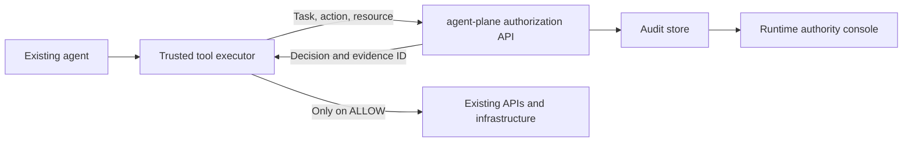

# agent-plane integration guide

Integrate agent-plane into the trusted backend that executes your agent's tools.
Keep your existing agent, model, and target systems. Add an authorization call
before each action and execute only when the response explicitly permits it.
The console reads evidence from the runtime; opening the console does not
automatically connect or intercept agents.

This guide describes the implementation in this repository, including its
current limits. It includes direct HTTP and the separately packaged Python SDK.
agent-plane is a standalone service; installing the SDK does not intercept tools
or install a framework plugin.

## 1. Where it fits

For the new gateway path, see the [MCP enforcement preview](../../spec/mcp-gateway-preview.md).
It includes a runnable MCP client/upstream demonstration and `/flow` walkthrough.
The direct-HTTP integration below remains supported; the preview does not
automatically intercept existing model or REST tool calls.



| Component | Integration responsibility |
| --- | --- |
| Your backend / orchestrator | Assign authenticated agent identity, create task IDs, and issue task-bound leases. |
| Your tool executor | Validate arguments, derive the canonical resource, call `/v1/authorize`, and enforce the result. |
| agent-plane | Evaluate capability and lease constraints, return a decision, and record authorization evidence. |
| Your external service | Execute the exact operation the trusted executor authorized. |
| Console | Read audit records and current leases; show missing evidence explicitly. |

The executor must hold the actual tool credentials. An agent with an independent
credential or network route to the target could bypass an optional authorization
check. Bind the task and identity to your authenticated workflow, rather than
accepting an arbitrary task chosen by the model.

## 2. Start a local runtime

From the repository root, create a virtual environment and install the project:

```powershell
python -m venv .venv
.venv\Scripts\Activate.ps1
python -m pip install -e ".[dev]" -e ./sdk/python
```

On macOS/Linux, activate with `source .venv/bin/activate` instead.
The repository already contains `config/` and `policies/`; when working in a
fresh directory with the package installed, `agentplane init` scaffolds them.

Generate local secret values:

```bash
python -c "import secrets; print('JWT_SECRET=' + secrets.token_urlsafe(32)); print('ADMIN_TOKEN=' + secrets.token_urlsafe(32)); print('AUDIT_SIGNING_KEY=' + secrets.token_urlsafe(32))"
```

Add that output to your local, ignored `.env` file without replacing unrelated
configuration, and set:

```dotenv
ENVIRONMENT=development
IDENTITY_MODE=jwt_claims
STORAGE_BACKEND=local
SQLITE_PATH=audit.db
```

Start the server from that directory:

```bash
agentplane serve --host 127.0.0.1 --port 8000
```

Open `http://127.0.0.1:8000/console`. `/healthz` reports liveness and
`/readyz` checks readiness. No model-provider credentials are required to run
the authorization example below.

If using the existing local preview on port **8765**, point `AGENT_PLANE_URL`
at `http://127.0.0.1:8765` and use the configuration of that running process.
Changing `.env` does not change a server that is already running; restart it
after configuration changes.

## 3. Keep the three credential roles separate

| Credential | Used by | Purpose |
| --- | --- | --- |
| Agent bearer token | Trusted executor acting for an agent | Authenticate runtime authorization and tool requests. |
| `ADMIN_TOKEN` / `X-Admin-Token` | Trusted lease issuer; console operator | Issue or inspect leases, read audit records, and access admin endpoints. |
| GitHub, cloud, or other tool credential | Trusted executor or registered broker adapter | Perform the actual target-system operation. |

The console only sends read requests, but its admin token is **not a scoped
read-only credential**: the backend also accepts it for administrative mutations.
Keep it out of agent prompts and client-side agent code. Production operator SSO
and scoped console access are not implemented in this reference console.

The example below uses HS256 `jwt_claims` mode with a token signed by the trusted
backend. Signed delegation identity is also available through
`IDENTITY_MODE=delegation`; see [EDGES.md](../../EDGES.md) for issuer configuration.
An empty capability list currently means no capability-level restriction, so
specify the intended capabilities explicitly.

## 4. Generate real authorization events

Save the following as a local Python script and run it from the same directory
as the server's `.env`, using the environment with agent-plane installed. It
issues one temporary lease and asks four authorization questions. It does not
restart or delete any real service. Runtime requests create audit records.

```python
import os
from datetime import UTC, datetime, timedelta
from uuid import uuid4

import httpx
import jwt

from agent_plane.config import Settings


def authorize(client, agent_token, *, task, action, resource):
    response = client.post(
        "/v1/authorize",
        headers={"Authorization": f"Bearer {agent_token}"},
        json={"task": task, "action": action, "resource": resource},
    )
    expected = {200: "allow", 202: "approval_required", 403: "deny"}
    if response.status_code not in expected:
        response.raise_for_status()
        raise RuntimeError("Unexpected authorization status")

    body = response.json()
    decision = body.get("detail", body) if isinstance(body, dict) else None
    if (
        not isinstance(decision, dict)
        or decision.get("decision") != expected[response.status_code]
        or not isinstance(decision.get("reason"), str)
        or not isinstance(decision.get("evidence_id"), str)
        or not decision["evidence_id"]
    ):
        raise RuntimeError("Invalid authorization response; action blocked")
    return decision


def main():
    settings = Settings()  # Reads the current environment and local .env.
    if settings.identity_mode != "jwt_claims" or not settings.admin_token:
        raise RuntimeError("This local example needs jwt_claims and ADMIN_TOKEN")

    base_url = os.environ.get("AGENT_PLANE_URL", "http://127.0.0.1:8000")
    run_id = uuid4().hex[:10]
    agent_id = f"acme:guide-agent:{run_id}"
    task_id = f"acme:repair-checkout:{run_id}"
    now = datetime.now(UTC)
    expiry = now + timedelta(minutes=30)
    token = jwt.encode(
        {
            "sub": "operator-42",
            "tenant": "acme",
            "agent_id": agent_id,
            "allowed_tools": ["deployment"],
            "iat": now,
            "exp": expiry,
        },
        settings.jwt_secret,
        algorithm=settings.jwt_algorithm,
    )
    lease = {
        "id": f"acme:lease:{run_id}",
        "subject": agent_id,
        "task": task_id,
        "resources": ["staging/*"],
        "actions": ["deployment.read", "deployment.restart"],
        "protected_resources": ["staging/locked/*", "production/*"],
        "require_approval": ["deployment.restart"],
        "expires_at": expiry.isoformat(),
        "child_authority": "none",
    }
    with httpx.Client(base_url=base_url, timeout=5.0) as client:
        issued = client.post(
            "/v1/leases",
            headers={"X-Admin-Token": settings.admin_token},
            json=lease,
        )
        issued.raise_for_status()

        cases = [
            ("deployment.read", "staging/checkout"),
            ("deployment.restart", "staging/checkout"),
            ("deployment.restart", "production/checkout"),
            ("deployment.read", "staging/locked/checkout"),
        ]
        for action, resource in cases:
            decision = authorize(
                client, token, task=task_id, action=action, resource=resource
            )
            print(action, resource, decision["decision"], decision["reason"])
            print("  evidence:", decision["evidence_id"])


if __name__ == "__main__":
    main()
```

Expected outcomes:

| Action / resource | Decision | Reason |
| --- | --- | --- |
| Read `staging/checkout` | ALLOW | `ACTION_WITHIN_TASK_AUTHORITY` |
| Restart `staging/checkout` | APPROVAL REQUIRED | `ACTION_REQUIRES_APPROVAL` |
| Restart `production/checkout` | DENY | `RESOURCE_OUTSIDE_DELEGATED_SCOPE` |
| Read `staging/locked/checkout` | DENY | `RESOURCE_PROTECTED` |

Production is outside `staging/*`, so its reason is outside delegated scope.
The locked staging resource matches the delegated scope but is carved out by
`protected_resources`, producing the separate protected-resource reason.

## 5. Wrap your existing executor

Reuse `authorize` above in your application's trusted tool dispatcher. Derive
the canonical resource from validated arguments and execute that exact target.
Use a server-bound task and authenticated agent token:

```python
def guarded_restart(client, agent_token, task_id, deployment, existing_restart):
    decision = authorize(
        client,
        agent_token,
        task=task_id,
        action="deployment.restart",
        resource=deployment,
    )
    if decision["decision"] == "approval_required":
        return {
            "status": "approval_required",
            "evidence_id": decision["evidence_id"],
        }
    if decision["decision"] != "allow":
        raise PermissionError(decision["reason"])
    return existing_restart(deployment)
```

`existing_restart` is your existing backend function. The wrapper intentionally
does not catch transport, authentication, or malformed-response errors and then
continue: any such failure must stop execution. The returned approval status
must pause the task in your orchestrator. The 202 payload carries an
`approval_id`; once an operator approves it (`POST /v1/approvals/{id}/approve`,
the console, or a webhook receiver), repeat the identical authorize call with
`"approval": "<id>"` to receive ALLOW / `ACTION_APPROVED` exactly once. Never
translate a pending decision into ALLOW yourself. See [approvals](approvals.md).

Authorization and execution are separate operations, not an atomic transaction.
The caller owns target validation, execution-result logging, idempotency, and
handling changes between authorization and execution. Avoid blindly retrying
authorization calls: a successful check can consume a configured use count even
if execution later fails; approval-required checks also consume uses today.

### Response contract

| HTTP status | JSON location | Caller behavior |
| --- | --- | --- |
| `200` | Top-level decision object | Execute only if `decision == "allow"`. |
| `202` | `detail` decision object | Pause for approval; do not execute. |
| `403` | `detail` decision object | Block and surface the reason. |
| `401`, validation errors, other failures | Error response | Stop; fix authentication or request errors. |
| Timeout or invalid JSON | No usable decision | Stop; never assume allow. |

In this FastAPI implementation, `202` is wrapped in `detail` even though it is a
2xx response. Do not use `response.ok` or `raise_for_status()` alone to authorize
execution. Both the direct-HTTP example and the packaged Python SDK handle
these shapes. The SDK also checks that the HTTP status matches the decision
and that the response contains a reason and evidence ID.

### Use the Python SDK in your executor

Install `./sdk/python` from this checkout, or the `agent_plane_sdk-*.whl`
provided with your release. The install name is `agent-plane-sdk`; the import
is `agentplane`. This client does not install the server.

```python
import os
from agentplane import AgentPlane

with AgentPlane(os.environ["AGENT_PLANE_URL"], os.environ["AGENT_TOKEN"]) as plane:
    decision = plane.authorize(
        task="fix-staging-checkout",
        action="deployment.restart",
        resource="staging/checkout",
    )
    if decision.allowed:
        # Your trusted executor performs the exact authorized operation here.
        print("Allowed", decision.evidence_id)
    elif decision.needs_approval:
        resumed = plane.wait_for_approval(decision, timeout=600)   # polls, then resumes
        print("Resumed", resumed.decision, resumed.reason)
    else:
        print("Blocked", decision.reason)
```

The lease subject and task must match this agent's identity and workflow.
Authentication, transport, and server errors propagate as HTTPX exceptions;
malformed or contradictory replies raise `AuthorizationProtocolError`.
An exception must stop execution. The client never retries authorization
automatically because a check may consume a lease use count. See the
[SDK reference](../../sdk/python/README.md).

## 6. Connect and use the console

1. Open `/console` on the runtime you want to inspect.
2. Choose **Live**, or open **Connection**.
3. The read-only Runtime URL identifies the same-origin backend serving the page.
4. Enter that server's `ADMIN_TOKEN` in the **X-ADMIN-TOKEN** field and connect.
5. Run the example above. The four decisions appear on the next refresh.

The stream polls `/v1/audit?limit=50` every four seconds while the page is visible
and polling is enabled. Pause stops periodic refresh; Refresh still works.
Selecting an event updates the execution chain, authority graph, and inspector.
Filters do not replace the selected evidence, and new events do not steal focus.

| Inspector | Available evidence |
| --- | --- |
| Lease Inspector | Current lease configuration when the event has an explicit lease reference. |
| Action-Grant Viewer | Recorded proposal and outcome beside available current authority context. |
| Consequence Map | Recorded proposal/target; downstream effects are not recorded by the current backend. Demo effects are illustrative. |
| Delegation Tree | Explicit successful lease-delegation references available in the audit window. |
| Audit Timeline | Selected and related available records, identifiers, hashes, and signatures. |

Some denials have no lease reference, so their lease inspector stays unknown.
Current lease data is not a historical snapshot. Signature presence is not
cryptographic verification, and authorization evidence is not proof of execution.

The token is held only in page memory. Disconnect clears the token and fetched
live evidence. Export creates JSON containing original evidence and separately
labeled supplemental context; it does not export the connection token. Demo data
and live data are never combined.

The header uses the `agent-plane` text wordmark. No approved graphic logo asset
is supplied in this repository; an invented symbol is not presented as its logo.

## 7. Other supported integration points

| Interface | Integration | Current boundary |
| --- | --- | --- |
| `POST /v1/chat/completions` | Route compatible Chat Completions requests through the gateway; configure provider credentials on the server. | This is not a universal proxy for arbitrary model APIs, and changing the model endpoint does not intercept tool execution. |
| `POST /v1/tools/invoke` | Register mock/HTTP adapters in `config/tools.yaml`; send tool name and arguments. | Evaluates tool policy and capabilities, but does not automatically evaluate task AuthorityLeases. |
| `POST /v1/retrieve` | Register knowledge sources and call the retrieval API. | Uses the repository's configured retrieval implementation; connecting an existing datastore requires an adapter. |
| `POST /v1/agents/delegate` | Obtain a scoped child identity token. | Requires configured signed delegation identity and signing key. |
| `POST /v1/leases/{id}/delegate` | The lease holder requests a child lease. | Separate from identity-token delegation; an active lease can be narrowed for a child, with attenuation checks. |
| `PATCH` / `DELETE /v1/leases/{id}` | Admin narrows or revokes authority. | Effective on every replica at its next evaluation. |
| `POST /v1/leases/from-template` | Admin issues a lease from a named template plus scoped variables. | Variables cannot contain globs or traversal. |
| `/v1/approvals` | Operators list, approve, and reject pending requests. | The console's Pending Approvals panel calls these with the admin token. |

To combine brokered execution with task authority, your trusted dispatcher must
check `/v1/authorize` before `/v1/tools/invoke` for the same proposed operation.
The agent must not be able to bypass that dispatcher and invoke the broker or
target directly. A framework's central tool-dispatch hook is a useful insertion
point. Alternatively, the optional [MCP gateway preview](../../spec/mcp-gateway-preview.md)
combines admission and dispatch for explicitly configured MCP tools. Its trusted
task bindings, protocol requirements, and development-only limits are documented
there; it does not intercept arbitrary framework calls.

## 8. Deployment boundaries

- Leases, use counters, approvals, and the MCP request ledger live in the SQL
  authority store (`AUTHORITY_STORE=sql`, the default), sharing the audit
  database. Every replica must point at the same database; with PostgreSQL,
  admission holds an advisory lock and use reservation is a single atomic
  update, so `--workers N` and multiple replicas are safe. `memory` restores
  the old single-process behaviour and is refused in production.
- Lease lookup currently uses subject and task, without a separate tenant key.
  Tenant-prefixing identifiers avoids accidental collisions but does not itself
  provide tenant isolation. Enforce ownership in your trusted issuer and add
  tenant-scoped storage/evaluation before sharing it across untrusted tenants.
- Signed delegation identity is supported; production startup checks reject
  particular default secrets but are not a full deployment security review.
  See [SECURITY.md](../../SECURITY.md) for the current boundaries.
- Approval requests are persisted and resumable (see [approvals](approvals.md));
  notifying the right human is your webhook receiver's job. Consequence
  assessment and rollback are not provided; `maximum_impact` is informational.
- Historical lease snapshots, complete approver lineage, and execution-result
  telemetry are not captured by the authority API. The console leaves these
  fields unknown instead of synthesizing evidence.

## 9. Verify the integration

Before connecting real side effects, use a stub executor and verify:

| Scenario | Expected result |
| --- | --- |
| In-scope allowed action | Stub executes exactly once; retain its evidence ID. |
| Out-of-scope / protected resource | Stub never executes; inspect the recorded denial reason. |
| Approval-required action | Stub never executes; workflow is pending. |
| Expired / revoked authority | New authorization attempts are denied. |
| Invalid agent token | Authentication fails and no action executes. |
| Authorization service unavailable / malformed response | No action executes. |
| Console wrong admin token | Authentication error; no sample data masquerades as live evidence. |
| Console missing historical data | Unknown fields remain explicit. |

Repository checks:

```bash
python -m pytest tests/test_authority.py tests/test_admin.py tests/test_production.py -q
```

The optional `tests/console.browser.cjs` uses Playwright installed as external
test tooling. Set `CONSOLE_URL` to a local `/console`, then run
`node tests/console.browser.cjs`. It tests the UI using isolated API fixtures and
writes screenshots and evidence exports to the OS temporary directory. The
console itself has no JavaScript runtime dependencies or frontend build step.

## 10. Distribute and release

Distribute the runtime to the service operator and the SDK to application
developers. Neither package is a framework plugin.

| Artifact | Install / run | Contents |
| --- | --- | --- |
| `agent_plane-0.2.0-py3-none-any.whl` | `python -m pip install <wheel>`; `agentplane serve` | FastAPI service, console, CLI, default policies and configuration. |
| `agent_plane_sdk-0.2.0-py3-none-any.whl` | `python -m pip install <wheel>`; `from agentplane import AgentPlane` | Authorization client with HTTPX as its only runtime dependency. |
| Docker image | Run the tested image with configured secrets and audit storage. | Runtime plus optional server, delegation, token, Postgres, and Redis dependencies. |

The commands below build local artifacts. Registry availability is a separate
release step; preparing packages does not publish them.

### Build and test locally

Run from the repository root with Python 3.11 or newer:

```bash
python -m pip install -e ".[dev]" -e ./sdk/python build twine
python -m pytest -q
python examples/check_release_version.py
python -m build --outdir dist/release/server
python -m build sdk/python --outdir dist/release/sdk
python -m twine check --strict dist/release/server/* dist/release/sdk/*
python examples/smoke_distribution.py --dist-dir dist/release
```

The smoke test creates a fresh virtual environment outside the checkout, installs
both wheels, checks CLI scaffolding and packaged defaults, starts the server,
and exercises the SDK against real authorization, lease, and audit endpoints.
It needs package-index access to install dependencies. Share the wheel files
through your internal artifact store or package index; application developers
only need the SDK wheel and access to the deployed runtime.

### Container deployment

With Docker running:

```bash
docker compose config --quiet
docker build --tag agent-plane:ci .
python examples/smoke_container.py --image agent-plane:ci --save dist/image.tar
docker run --name agent-plane-local -p 127.0.0.1:8000:8000 --env-file .env \
  -e SQLITE_PATH=/data/audit.db -v agent-plane-audit:/data agent-plane:ci
```

On PowerShell, put the `docker run` command on one line or use a backtick instead
of the shell continuation character. Set strong, distinct `JWT_SECRET`,
`ADMIN_TOKEN`, and `AUDIT_SIGNING_KEY` values as described above. The explicit
SQLite path overrides `SQLITE_PATH=audit.db` in a local `.env` file.

The smoke test uses an isolated container and named volume, confirms UID 10001,
tests all three decisions, then restarts the container to check audit persistence.
It also confirms that a runtime-issued lease survives the restart. Its temporary
container and volume are removed afterward. `--save` writes the tested image
for transfer using `docker load --input dist/image.tar` on another host.

`docker compose up --build` instead runs the gateway with Postgres audit storage
and Redis cache/quota storage in named volumes. Compose forwards the configured
admin and identity settings; its bundled database credentials are local defaults.
Both deployments persist leases and approvals alongside the audit chain.
For more than one replica use the Compose profile or the Helm chart in
[deploy/](../../deploy/README.md). Production identity,
network access, and credentials still require the setup in [SECURITY.md](../../SECURITY.md).

### GitHub release workflow

The repository's [release workflow](../../.github/workflows/release.yml) calls the
[CI workflow](../../.github/workflows/ci.yml) before publishing. Required jobs cover
Python 3.11/3.12 tests, clean wheel installation, container runtime and persistence,
and console browser regression checks. Existing lint and dependency-audit jobs
are informational; review their output separately.

1. Configure PyPI trusted publishing for **both** `agent-plane` and
   `agent-plane-sdk`, using this repository owner/name, workflow `release.yml`,
   and GitHub environment `pypi`. Create the GitHub environment and configure
   any desired protection rules. No PyPI API token is used by this workflow.
2. Ensure the repository's GitHub Actions token can publish its GHCR package.
   The image destination is `ghcr.io/<owner>/<repository>:<version>` in lowercase.
   Set package visibility/access for intended consumers after initial publication.
3. Keep versions in root `pyproject.toml` and `sdk/python/pyproject.toml` equal.
   Choose an unused release version and update the versioned examples as needed.
4. Run **Release → Run workflow** on the intended commit first. Manual dispatch
   validates versions and uploads `tested-distributions` and `tested-container`
   artifacts; it does not publish to either registry.
5. When ready to publish, push a tag exactly matching `v<version>` (for example,
   `v0.2.0` only if both packages still declare `0.2.0` and it is unused).
   The tagged run repeats the checks and publishes those exact tested artifacts.

PyPI and GHCR publication are separate jobs and are not an atomic release.
Inspect all publication jobs before announcing availability. Once published,
consumers can install `agent-plane==<version>` or `agent-plane-sdk==<version>`
from the configured index and pull the matching container version.

## Troubleshooting

| Symptom | Check |
| --- | --- |
| Console `401` | The supplied token must match the running server's `ADMIN_TOKEN`, not an agent bearer token. |
| Admin endpoint `404` | Admin APIs are disabled when `ADMIN_TOKEN` is unset. |
| `NO_ACTIVE_LEASE` | Agent identity and task must match the lease subject and task. |
| `ACTION_OUTSIDE_CAPABILITY_MANIFEST` | Check the token's allowed capability namespace or exact action. |
| Pending approval treated as success | Unwrap the `detail` object and inspect the decision, including for HTTP `202`. |
| Lease state differs from YAML after restart | Stored leases win over the YAML seed, so a revocation or shrink is never undone by a redeploy; delete the row or issue a new lease id. |
| `APPROVAL_MISMATCH` on resume | The resume must repeat the exact task, action, and resource the approval was raised for. |
| Empty live stream | Execute authorization requests against the same server; connecting the console does not generate events. |
| Demo differs from live inspector | Demo contains labeled illustrative context that the current audit schema cannot supply. |

Further references: [integration overview](README.md),
[configuration](../../CONFIGURATION.md), [endpoint examples](../../EDGES.md), and
[authority specification](../../spec/authority-lease.md). Where older narrative notes
conflict, use the current endpoint implementation and tested behavior in this guide.
